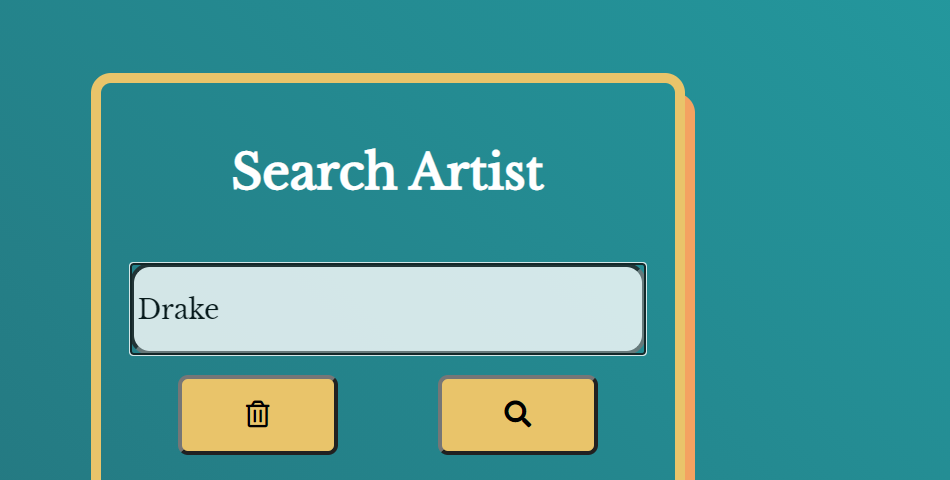
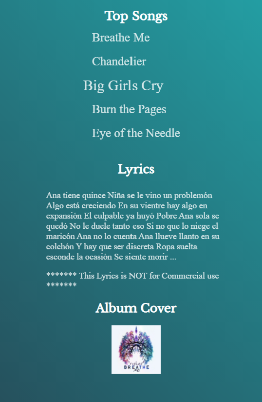
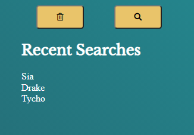

# Playlist-Repo

Users can use this app to discover the top 5 songs of any given artist and the start of the selected songs lyrics using TheAudioDB and MusixMatch APIs. 

## User Story 

```
AS a user
I want to find an artists top 5 songs and its lyrics 
SO I can discover artists fan favorites
```

### Demo
To get started, enter the name of an artist into the search field. 



You will see the artists' top songs along with an album cover. (Displayed below or to the right of the search field depending on your device) 

Click on a song to reveal the lyrics.



Clear the search by clicking on the yellow trash button.



### Deployed link

```
link: https://abissier.github.io/Playlist-Repo/
```
### Screencapture 
<br>
<a href="https://ibb.co/D4z5gwh"></a><br /><a target='_blank' href='https://emoticoncentral.com/category/motor-boat'>motor boat emojis</a><br />